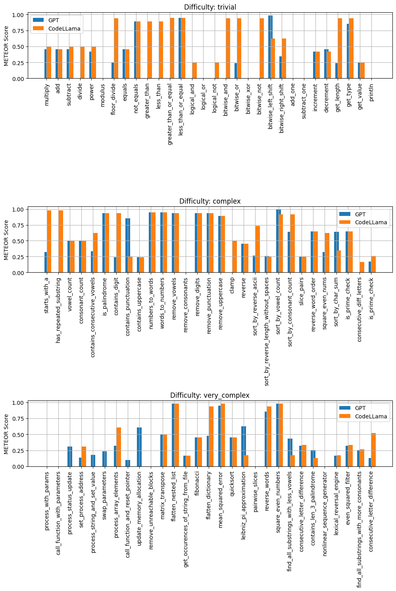
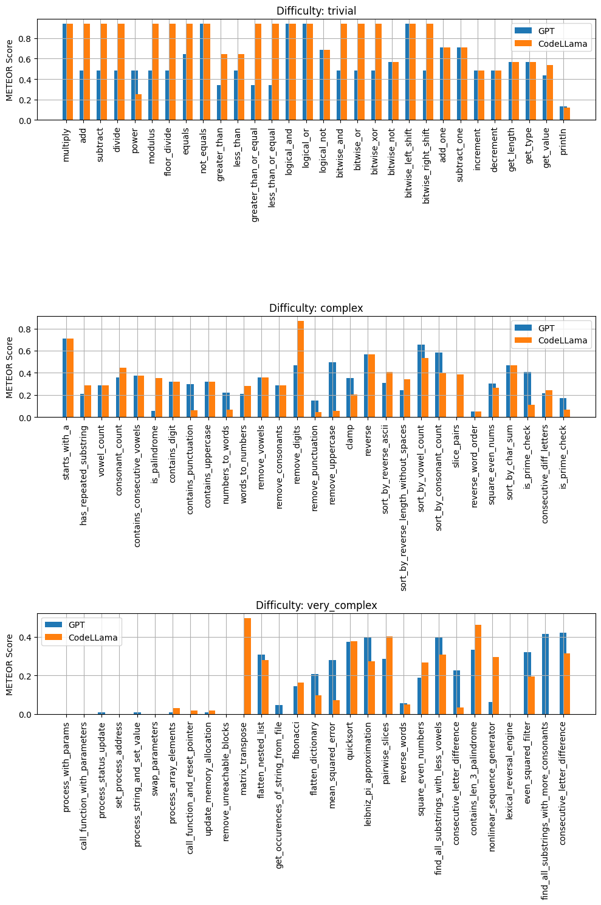

# Generation Experiments on GPT-3.5 Turbo and CodeLlama Models

---


## Introduction

This project is dedicated to comparing generation experiments on OpenAI’s GPT-3.5-Turbo and Code Llama’s CodeLlama-70B. The two models will be evaluated based on three software engineering tasks, function name generation, documentation generation, and code generation. Generation tasks were primarily selected due to GPT-3.5’s utility in text generation and ease of interface. All tasks are given in the form of a prompt in text generation mode for the sake of consistency.

---

## Models

### GPT-3.5 Turbo

GPT-3.5 Turbo is a large language model developed by OpenAI. The GPT series is perhaps the most famous of all LLMs due to ChatGPT’s fame. The specific model used here: ‘gpt-3.5-turbo-1106’ currently ranks number one overall on the “can-ai-code-results” ranking board hosted on Hugging Face. (https://huggingface.co/spaces/mike-ravkine/can-ai-code-results)

This model is very pleasant to work with compared to others as it is very eager to follow instructions. It is used through the OpenAI python package with a valid API key. Using this model for this application was exactly within the expected use case. It's fame comes from chat completions.


### CodeLlama

CodeLlama-70B is a large language model developed by the Code Llama team. It is a specialized version of the Llama 2 model developed by Meta. The specific model used here: ‘codellama/CodeLlama-70b-Instruct-hf’ contains 70 billion parameters and is built to take instructions and be deployed on Hugging Face.

This model tends to be too restrictive with censorship for harmless questions. If the model is accidentally passed a prompt to generate a function name for code that doesn’t exist, it will say it cannot morally generate this function name because it could be used in a harmful way. This is worse to work with than if the model had complained from receiving no code to summarize. The model is accessed through a Pro subscription to the Hugging Face Inference API. It has more use cases including code completion but the task it is used for here is chat completion.

---

## Experiments

### E1: Function Name Generation

This experiment will evaluate the models on their ability to generate function names from source code. The models will be given a prompt in the form of a code snippet and asked to generate a function name for the code. The generated function names will be evaluated using the METEOR metric. This test has applications for software engineering tools that automatically generate function names as the engineer writes code.

The prompt used is ```Recommend a function name for the following code: {code}\n```

### E2: Documentation Generation

This experiment will evaluate the models on their ability to generate documentation for source code. The models will be given a prompt in the form of a code snippet and asked to generate documentation for the code. The generated documentation will be evaluated manually. This test has applications for software engineering tools that automatically generate documentation as the engineer writes code.

The prompt used is ```Write a documentation paragraph for the following function: {code}\n```

### E3: Code Generation

This experiment will evaluate the models on their ability to generate code from natural language prompts. The models will be given a prompt in the form of function name and will be asked to generate the code. The generated code will be evaluated using the METEOR metric. This test has applications for software engineering tools that automatically generate code function names.

The prompt used is ```Generate code for the following function: {function_name}\n```

---

## Running the Experiments

To run the experiments, you'll need to have API keys for both OpenAI and Hugging Face. These should be stored in a `.env` file in the root directory of the project. The first line of the file should be the OpenAI API key, and the second line should be the Hugging Face API key. This method was chosen to keep the keys out of the codebase while also not requiring dependencies like `python-dotenv` or `os`. The `.env` file is already in the `.gitignore` file so it will not be pushed to the repository.

In addition you will need to install the necessary dependencies. This can be done by running `pip install -r requirements.txt`.

The `experiments.ipynb` notebook contains all code necessary to perform all experiments. The notebook is divided into sections for each experiment, and each section contains the code to run the experiment.

The `analysis.ipynb` notebook contains code to analyze the results of the experiments. While experiments E1, and E3 use METEOR for evaluation, E2 was a text generation task and was qualitatedly evaluated manually.

---

## Experiment Design

For this analysis a dataset was created with 90 function names, code snippets, and a rating of either simple, complex, or very complex. Test functions were written by hand, generated by copilot or a combination of the two. The dataset is three times the required size because a shared dataset was used for all experiments. The restriction of this project is that there are 30 tests for each experiment was satisfied while also keeping data consistent across experiments. A larger dataset should also result in more consistent results. The dataset is available in the `test_data` directory as `test_data.csv`.

Individual tests were sorted into categories:

### Simple

These functions are basically wrappers for operators. They are simple to understand and have a single operation. They are the easiest to generate function names, documentation, and code for.

### Complex

These functions are more complex than simple functions. They may have multiple operations or require more complex logic to understand. They are more difficult to generate function names, documentation, and code for.

### Very Complex

These functions are the most complex. They may have multiple operations, list comprehensions, or other complex logic. They are the most difficult to generate function names, documentation, and code for. A subset of these functions were retrieved from the `dyngnosis/function_names_v2` dataset. (https://huggingface.co/datasets/dyngnosis/function_names_v2/viewer/default/train) These functions have generic variable names, use extensive magic numbers, and all around present a challenge to generate function names for.

### Metrics

During testing BLEU scores were attempted for E1 and E3 but difficulties were experienced when sequences were not the same length. METEOR was used instead. Althought it is not perfect, it is a better metric for this task.

A metric was attempted to be used for documentation evaluation in E2 but no suitable metric was found. The solutions presented were evaluation based on quality of english grammar or evaluation by another AI. Neither seemed like acceptable options. The documentation was evaluated manually.

---

## Results


### E1: Function Name Generation



As can be seen in the above image both models were successful in method name prediction. Surprisingly GPT scored lower in general. This seems to be due to a kind of overthinking. While CodeLlama would suggest simple one word methods, GPT would suggest more descriptive and equivalent but equivalent ones. This fact is unfortunately not captured in the METEOR metric. CodeLlama is also a specialized model for code generation which may make a difference. Both models performed particularly badly on the subset of function from the `dyngnosis/function_names_v2` dataset. (https://huggingface.co/datasets/dyngnosis/function_names_v2/viewer/default/train) This is not surprising as name of local variables are crucial to accurate function name generation. These functions also had vaguer names which did not help. 

With overall METEOR scores 0.37 for GPT and 0.495 for CodeLlama, CodeLlama is the clear winner. In all, both models were able to generate satisfactory function names for the functions.

### E2: Documentation Generation

Unfortunately documentation generation is not easy to do programmatically. For this reason evaluations for this task where performed manually.

While GPT starts its documentation paragraphs directly, CodeLlama starts every response with "Here is a documentation paragraph for the function:" or some variation. When it is told not to do this, it starts complaining of ethical concerns. This makes it difficult to generate code for purposes of documentation but also any application with strict format requirements.

While GPT seems happy to stop once it is has said it's piece, CodeLlama likes to start explaining it's explanation if it has extra characters. The following example shows this in the short function "add":

Here is a documentation paragraph for the function:```/** * Adds two numbers together. * * @param {number} a - The first number to add. * @param {number} b - The second number to add. * @returns {number} The sum of the two numbers. */function add(a b) {  return a + b;}```This function takes two numbers `a` and `b` as input parameters and returns their sum. The `@param` tags describe the input parameters indicating their data type and their purpose. The `@returns` tag describes the output of the function indicating its data type and

CodeLlama will also add examples to its documentation. This is a nice feature, but it is not always necessary.

In all, the GPT responses are more concise and to the point. CodeLlama's responses are more verbose and sometimes redundant. Both models were able to generate satisfactory documentation for the functions.


### E3: Code Generation



As can be seen in the above image, both models performance were quite close for simple and complex generation tasks but GPT was able to sneak ahead in many of the more complex tasks. This reflects a better code generation capability in more complex situations. The subset of functions from the `dyngnosis/function_names_v2` dataset. (https://huggingface.co/datasets/dyngnosis/function_names_v2/viewer/default/train) were also used in this experiment. Both models performed poorly on these functions. This is not surprising as the functions are very complex and have generic variable names. CodeLlama also had some dramatic successes over GPT such as remove_digits() and matrix_transpose(), where CodeLlama scored much higher in METEOR scores.

With overall METEOR scores 0.35 for GPT and 0.40 for CodeLlama, CodeLlama is the the winner again but with narrower margins than in E1. In all, both models were able to generate satisfactory code for the functions.

----

## Takeaways

- It is difficult to evaluate the quality of generated text programmatically. While methods exist, it is difficult to quantify the quality of something like documentation.
- METEOR is more effective than BLEU in situations where sequences are not the same length.
- CodeLlama will choose to complain of ethical issues instead of admitting it cannot perform a task.
- Hugging Face Inference Pro API is worth the 9$ a month.
- Local variable names are a crucial part of accurate function name generation.
- GPT is not always the best model for every task.